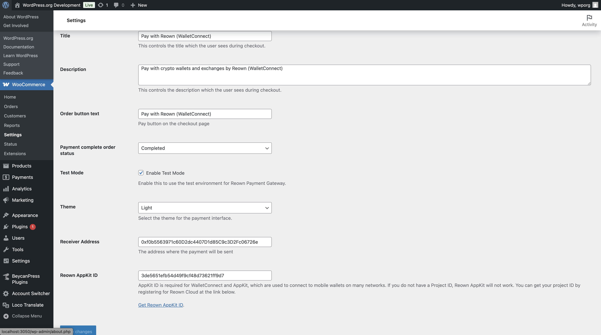

# Reown (WalletConnect) Crypto Payment Gateway for WooCommerce

As soon as Reown announced AppKit Pay, we rolled up our sleeves and set out to integrate it for WooCommerce. This version, which will be further developed in the future, is now available. All you need to do is enter your wallet address in the settings and create an AppKit ID (Project ID) via Reown Cloud and it's ready to use. Now you can accept crypto payments with Reown (WalletConnect) AppKit Pay directly with WooCommerce.

See AppKit Pay here: https://docs.reown.com/appkit/payments/overview#appkit-pay

# Supported networks

- Ethereum
- Polygon
- Binance Smart Chain
- Avalanche
- Base

And the testnet networks of these networks. We will add more networks in the future.

# Supported currencies

Only native coin (like ETH, MATIC, BNB, AVAX, etc.) and some popular tokens (like USDC, USDT, DAI, etc.) are supported. We will add more tokens in the future.
